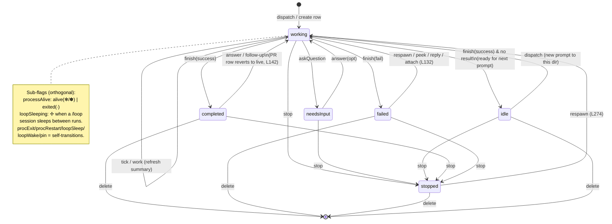
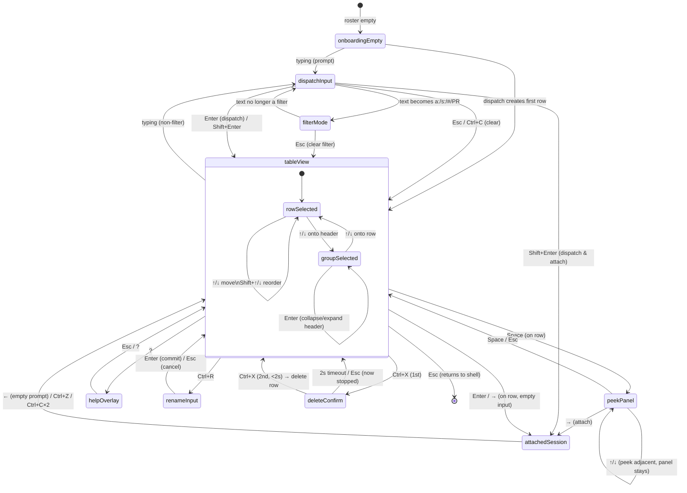

# Agent View — Formal State Machine

Implementation-ready specification of two cooperating state machines for the Agent View mock:

1. **Per-session lifecycle FSM** — the state of a single background session row.
2. **App / UI-mode statechart** — the mode of the whole screen.

Sources: `SPEC/_raw-inventory.md` (citations `L#` into `RESEARCH/agent-view-docs.md`) and `RESEARCH/web-behavior.md`. Everything here is derived strictly from those; nothing invented. Where the docs are silent on a mock concern, it is flagged `[mock-only]`.

---

## Part A — Per-Session Lifecycle FSM

A session row carries **three orthogonal axes** that the docs treat as independent (inventory §1, §2):

| Axis | Values | Visual encoding |
| :--- | :----- | :-------------- |
| **taskState** (the FSM below) | `idle`, `working`, `needsInput`, `completed`, `failed`, `stopped` | icon **color / animation** (L107, L109-116) |
| **processAlive** (sub-flag) | `alive` / `exited` | icon **shape** `✻`/`✽` vs `∙` (L118-124) |
| **loopSleeping** (sub-flag) | `false` / `true` | icon shape `✢` + run count + countdown (L122, L97) |

`processAlive` and `loopSleeping` are **sub-flags layered on top of** `taskState`, not states of it. A `working` session can be process-alive *or* exited (`∙` still restarts from where it left off, L121); a `working` `/loop` session that is sleeping shows `✢` (L122). Encodings:

- `✽` (animated) = `taskState=working` AND `processAlive=alive`
- `✻` (static)   = `processAlive=alive` AND not actively generating (idle/completed/needsInput while warm)
- `∙`            = `processAlive=exited` (any taskState; still peek/reply/attach-able, L121)
- `✢`            = `loopSleeping=true` (a `/loop` session between iterations, L122)

### A.1 State meanings (verbatim, L109-124)

- **idle** — dimmed. Session has nothing to do, ready for your next prompt (L118).
- **working** — animated. Claude is actively running tools or generating (L111).
- **needsInput** — yellow. Waiting on a specific question or permission decision (L114).
- **completed** — green. Task finished successfully (L119).
- **failed** — red. Task ended with an error; also the state after machine shutdown (L120, L132).
- **stopped** — grey. Stopped with `Ctrl+X` or `claude stop` (L121).

Note (inventory §3, L189): the **Completed group** collects `completed + failed + stopped`; group membership ≠ taskState. The lifecycle FSM below models `taskState` only.

### A.2 Events

| Event | Trigger (real world) | Trigger (mock) |
| :---- | :------------------- | :------------- |
| `dispatch` | prompt + `Enter` spawns a new session (L242) | creates a row in `working` |
| `tick`/`work` | summary refresh ≤ every 15s while working + once per turn end (L137) | scripted timer advances summary/`done/total` |
| `askQuestion` | session hits a question / permission gate | scripted |
| `answer(opt)` | user replies in peek (`Enter`/number key) or attached (L165) | user or scripted |
| `finish(success)` | turn ends with a result | scripted |
| `finish(fail)` | turn ends with an error (L120) | scripted |
| `loopSleep` | `/loop` session enters sleep between iterations (L122) | scripted timer |
| `loopWake` | countdown reaches 0, next iteration starts (L97) | scripted timer |
| `stop` | `Ctrl+X` once, `/stop`, or `claude stop` (L121, L231) | user |
| `delete` | second `Ctrl+X` within 2s, or `claude rm` (L198, L231) | user (removes row + worktree, L Research §Write isolation) |
| `respawn` | `claude respawn` / attach-peek-reply after Failed (L132, L274) | user / scripted |
| `procExit` | idle GC after ~1h, or process exits (L121, Research idle GC) | scripted timer → sets `processAlive=exited` |
| `procRestart` | next peek/reply/attach restarts process (L121) | scripted on interaction |
| `pin` / `unpin` | `Ctrl+T` (L193, L230) | user; sets `pinned`, exempts from GC |

`pin`, `procExit`, `procRestart`, `loopSleep`, `loopWake` mutate **sub-flags**, not `taskState` (self-transitions on the FSM; listed in the table for completeness).

### A.3 Mermaid — session lifecycle

### A.4 Session transition TABLE

| # | Event | From | To | Guard | Side-effect |
| :- | :---- | :--- | :- | :---- | :---------- |
| S1 | `dispatch` | (none) | `working` | prompt ≥ 4 chars (else `Too short`, L513); under thread limit (Research) | create row, auto-name from prompt, `processAlive=alive` (`✽`), start summary timer; auto-move to worktree before first edit |
| S2 | `tick`/`work` | `working` | `working` | `processAlive=alive` | refresh one-line summary (≤1×/15s, L137) via Haiku call; update `done/total` if ≥2 parallel items (L138); update time-ago |
| S3 | `askQuestion` | `working` | `needsInput` | — | set icon yellow; show question/permission in summary; bump tab-title awaiting-input count (L128) |
| S4 | `answer(opt)` | `needsInput` | `working` | reply non-empty or valid option number | send reply to session; decrement awaiting-input count; icon back to animated |
| S5 | `finish(success)` | `working` | `completed` | task produced a result | icon green; summary = `result: …`; may open PR → row joins **Ready for review** if PR present (L189) |
| S6 | `finish(success)` (no result) | `working` | `idle` | nothing left to do (L118) | icon dimmed; row ready for next prompt |
| S7 | `finish(fail)` | `working` | `failed` | error occurred | icon red; failures always stay visible, never fold (L202) |
| S8 | `stop` | `working`/`needsInput`/`idle`/`completed`/`failed` | `stopped` | first `Ctrl+X`, `/stop`, or `claude stop` | icon grey; process ends; arms 2s delete window in UI (see U-layer) |
| S9 | `delete` | `completed`/`failed`/`stopped`/`idle` | (removed) | second `Ctrl+X` within 2s, OR `claude rm` | remove row; `Ctrl+X` path **deletes worktree incl. uncommitted changes**; `claude rm` keeps dirty worktree + prints path (Research §Write isolation) |
| S10 | `respawn` | `stopped`/`failed` | `working` | `claude respawn` / `respawn --all` (L274) | restart process onto current binary; `processAlive=alive` |
| S11 | `failedRecover` | `failed` | `working` | peek / reply / attach a Failed session (L132) | restart from last checkpoint; `processAlive=alive` |
| S12 | `followUp` | `completed` | `working` | user sends follow-up; PR label persists (L142) | row reverts to live progress, PR label stays visible |
| S13 | `procExit` | any `taskState` | (same) | idle ≥ ~1h & not pinned, OR memory pressure (Research GC) | `processAlive=exited` → icon `∙`; transcript/state stay on disk |
| S14 | `procRestart` | any `taskState` | (same) | peek/reply/attach an `∙` session (L121) | `processAlive=alive`; noticeable startup delay |
| S15 | `loopSleep` | `working` | `working` | session is a `/loop` between iterations (L122) | `loopSleeping=true` → icon `✢`; show `run N` + countdown |
| S16 | `loopWake` | `working` | `working` | countdown reaches 0 (L97) | `loopSleeping=false`; increment run count; resume work |
| S17 | `pin`/`unpin` | any | (same) | `Ctrl+T` (L193) | toggle `pinned`; pin keeps process running while idle, exempts from GC, moves row to **Pinned** group |
| S18 | `shutdown` | `working`/`needsInput`/`idle` | `failed` | machine shutdown (L132) | mark Failed (red); recoverable via S11 |

---

## Part B — App / UI-Mode Statechart

The whole screen is in exactly one **mode** at a time. `tableView` is the root/default; most modes return to it on `Esc`.

### B.1 Modes

| Mode | Meaning | Entry source |
| :--- | :------ | :----------- |
| `onboardingEmpty` | Pre-first-dispatch hint + example prompts replace the list (L505); also a lone `←`-created empty row shows a hint (L185) | initial / empty roster |
| `tableView` | Default grouped session list, one row selected (L72-103) | root |
| `peekPanel` | Peek overlay for selected row: recent output **or** pending question, PRs (L57, L160) | `Space` from table |
| `attachedSession` | Fullscreen interactive session; agent view is *replaced* (L60-62, L172-183) | `Enter`/`→`/`Shift+Enter` |
| `helpOverlay` | All shortcuts in context (L216, L235) | `?` |
| `renameInput` | Inline rename of selected session (L195, L229) | `Ctrl+R` |
| `deleteConfirm` | Armed-for-2s delete confirmation after first `Ctrl+X` (L198, L231) | first `Ctrl+X` |
| `filterMode` | Typing `a:`/`s:`/`#`/PR URL in dispatch input filters the list (L206-212) | typing a filter prefix |
| `dispatchInput` | Dispatch input has text; `Enter` dispatches a new session (L242) | typing a non-filter prompt |

`tableView` has an internal **selection** sub-state (`↑`/`↓` move; `Shift+↑`/`Shift+↓` reorder, L226). Selection target may be a **session row** or a **group header** (changes `Enter`/`Ctrl+X` semantics, L196, L198).

### B.2 Mermaid — UI-mode statechart

### B.3 UI-mode transition TABLE

| # | Event/Key | From | To | Guard | Side-effect |
| :- | :-------- | :--- | :- | :---- | :---------- |
| U1 | (init) | `[*]` | `onboardingEmpty` | roster empty before first dispatch (L505) | show onboarding hint + example prompts |
| U2 | typing | `onboardingEmpty` / `tableView` | `dispatchInput` | first char typed, not a filter prefix | echo text in dispatch input |
| U3 | typing | `dispatchInput` | `filterMode` | text starts `a:`, `s:`, or is `#<n>`/PR URL (L208) | filter list live instead of dispatching |
| U4 | typing | `filterMode` | `dispatchInput` | text no longer matches a filter prefix | resume dispatch semantics |
| U5 | `Enter` | `dispatchInput` | `tableView` | input ≥ 4 chars (else `Too short`, L513) | dispatch new session (S1); clear input; new row selected |
| U6 | `Shift+Enter` | `dispatchInput` | `attachedSession` | input ≥ 4 chars (L240) | dispatch new session AND attach to it immediately |
| U7 | `Enter` | `filterMode` (`#`/PR) | `tableView` | a session already works that PR (L210) | select that session instead of dispatching |
| U8 | `Esc` / `Ctrl+C` | `dispatchInput` / `filterMode` | `tableView` | — | clear input / clear filter (L233, L234) |
| U9 | `Space` | `tableView` | `peekPanel` | a **row** is selected (not header) | open peek: show recent output or pending question + PRs (L160) |
| U10 | `Space` / `Esc` | `peekPanel` | `tableView` | — | close peek (L222, L233) |
| U11 | `↑`/`↓` | `peekPanel` | `peekPanel` | adjacent row exists | peek adjacent session without closing panel (L169) |
| U12 | number key | `peekPanel` | `peekPanel` | session shows multiple-choice question (L165) | pick option → emits `answer(opt)` (S4) |
| U13 | `Tab` | `peekPanel` | `peekPanel` | session is blocked/needsInput (L165) | fill input with suggested editable reply |
| U14 | `Enter` | `peekPanel` | `peekPanel` | reply text present | send reply to session (emits `answer`, S4); panel stays |
| U15 | `→` | `peekPanel` | `attachedSession` | — | attach to peeked session (L169) |
| U16 | `Enter` / `→` | `tableView` (row) | `attachedSession` | input empty AND a row selected (L172) | replace agent view w/ fullscreen session; post recap (L173) |
| U17 | `Alt+1`..`Alt+9` | `tableView` | `attachedSession` | session N exists in focused dir (L224) | attach to session 1–9 |
| U18 | `←` | `attachedSession` | `tableView` | prompt empty AND `leftArrowOpensAgents` enabled (L179, L185) | detach (session keeps running); reselect its row |
| U19 | `Ctrl+Z` | `attachedSession` | `tableView` | dialog has focus & ignores `←` (L179) | detach immediately; session keeps running |
| U20 | `Ctrl+C`×2 | `attachedSession` | `tableView` | empty prompt (L183); single `Ctrl+C` cancels running response/`!` cmd | detach; session keeps running |
| U21 | `Esc` | `attachedSession` | shell | — | exit to shell; session keeps running (L45) |
| U22 | `?` | `tableView` | `helpOverlay` | — | show all shortcuts in context (L235) |
| U23 | `Esc` / `?` | `helpOverlay` | `tableView` | — | close overlay |
| U24 | `Ctrl+R` | `tableView` | `renameInput` | a row selected (L229) | open inline rename editor |
| U25 | `Enter` | `renameInput` | `tableView` | name non-empty | commit new name |
| U26 | `Esc` | `renameInput` | `tableView` | — | cancel rename |
| U27 | `Ctrl+X` (1st) | `tableView` (row) | `deleteConfirm` | a row selected | stop session (S8); arm 2s delete window (L231) |
| U28 | `Ctrl+X` (2nd) | `deleteConfirm` | `tableView` | within 2s of U27 | delete session (S9): remove row + worktree |
| U29 | 2s timeout / `Esc` | `deleteConfirm` | `tableView` | 2s elapsed without 2nd `Ctrl+X` | disarm; session remains `stopped`, row kept |
| U30 | `Ctrl+X` (header) | `tableView` (group header) | `deleteConfirm` | a **group header** selected (L198) | confirm-delete **every session in group** |
| U31 | `Enter` (header) | `tableView` (group header) | `tableView` | a group header selected (L196) | collapse/expand that group |
| U32 | `Ctrl+S` | `tableView` | `tableView` | — | toggle grouping state↔directory; persists across runs (L228); dispatch target = highlighted row's dir (L273) |
| U33 | `Ctrl+T` | `tableView` | `tableView` | a row selected (L230) | pin/unpin (emits `pin`/`unpin`, S17) |
| U34 | `Ctrl+G` | `tableView` / `dispatchInput` | (external editor) | — | open dispatch prompt in `$VISUAL`/`$EDITOR` (L232) |
| U35 | `Esc` | `tableView` | shell | input empty, no overlay open | exit agent view to shell (L45) |
| U36 | `Ctrl+C`×2 | `tableView` | shell | — | clear input; twice exits (L234) |
| U37 | `←` (from any session) | (any Claude session) | `tableView` | empty prompt; `leftArrowOpensAgents` on (L185) | background current session, open agent view with its row selected |

### B.4 Mode-precedence / guard notes

- **Typing disambiguation (U2/U3):** the *same keystroke* routes to dispatch vs filter purely by the prefix grammar (`a:`/`s:`/`#`/PR → filter; else dispatch). The mock must evaluate this on every input change.
- **`Enter` is overloaded** (L223): in `tableView` with empty input → attach; with text → dispatch; on a group header → collapse; in `peekPanel` → send reply; in `renameInput` → commit. Guard on **focus + selection type + input contents**.
- **`Ctrl+X` is a 2-stroke chord** with a 2s arming window (`deleteConfirm`). On a header it confirms a group-wide delete. Guard on selection type and elapsed time.
- **`Esc` is a layered "back"** (L233): peek → close panel; input → clear; otherwise → exit to shell. Resolve innermost overlay first.
- **`Space`** only toggles peek for a **row**, never a header.

---

## Part C — Scripted vs User-Driven (mock guidance)

In a real Agent View, session transitions are driven by the live daemon + LLM. In the **mock**, classify every transition as **user-driven** (fires on a real key/click) or **scripted** (fires on a timer / seeded timeline) so the demo feels alive without a backend.

### C.1 Session-layer (Part A)

| Driver | Transitions | Mock implementation |
| :----- | :---------- | :------------------ |
| **User-driven** | S1 `dispatch`, S4 `answer`, S8 `stop`, S9 `delete`, S10 `respawn`, S11 `failedRecover`, S12 `followUp`, S14 `procRestart`, S17 `pin` | wired to keys in Part B (U5/U6, U12/U14, U27, U28, etc.) |
| **Scripted** | S2 `tick`/`work` (summary refresh on ~15s cadence), S3 `askQuestion`, S5/S6/S7 `finish(*)`, S13 `procExit` (~1h GC, compress to seconds in mock), S15 `loopSleep`, S16 `loopWake` (countdown), S18 `shutdown` | a seeded timeline per row advances summaries, flips state, runs the `✢` countdown, and toggles `∙` after an idle timer |
| **Hybrid** | S4 `answer` (user reply) immediately followed by scripted S2/S5 to simulate the session "responding" | on user answer, queue a short scripted follow-up so the row visibly progresses |

Recommended mock cadence (compressed from documented timings): summary refresh every ~3–5s while `working` (stands in for 15s, L137); `procExit` after ~30–60s idle (stands in for ~1h GC); empty `←` row cleanup ~30s (stands in for ~5min, L185); `✢` loop countdown drawn live from `in 4m`-style label (L97).

### C.2 UI-layer (Part B)

| Driver | Transitions |
| :----- | :---------- |
| **User-driven (all of them)** | every U-row fires on a real keystroke — `Space`, `Enter`, `→`, `←`, `Esc`, `?`, `Ctrl+R`, `Ctrl+X`×2, `Ctrl+S`, `Ctrl+T`, `Shift+Enter`, `Alt+1..9`, typing |
| **Scripted (mode-affecting)** | U29 `deleteConfirm` 2s timeout is the **only** timer-driven UI transition; U1 `onboardingEmpty` is state-driven (fires when scripted roster empties/fills) |

**Determinism note for the mock:** UI modes are fully deterministic on user input; only `deleteConfirm`'s 2s window and the session timeline carry timers. Seed the roster with one row per documented state (`✽` working, `✻` needsInput, `∙` completed-exited, `✢` loop-sleeping, red failed, grey stopped, a Pinned row, and a `… N more` fold) so all visual encodings render without waiting on a script.
